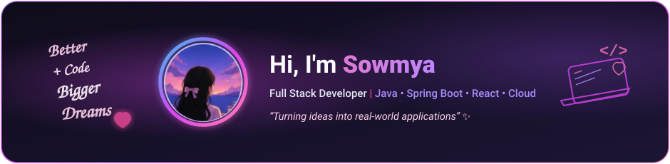
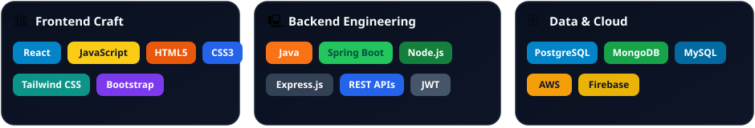
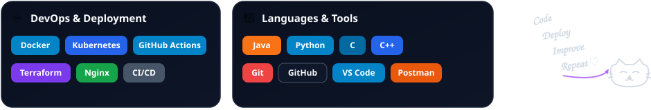

  <!-- ==================== HERO BANNER ==================== -->
  

    

<!-- ==================== ABOUT ME ==================== -->
## 👤 About Me

  

 

<!-- ==================== LET'S CONNECT ==================== -->
## 🔗 Let's Connect

<table border="0" cellpadding="0" cellspacing="6" width="100%">
  <tr align="center">
    <td width="25%" align="center" style="border: none;">
      
    </td>
    <td width="25%" align="center" style="border: none;">
      
    </td>
    <td width="25%" align="center" style="border: none;">
      
    </td>
    <td width="25%" align="center" style="border: none;">
      
    </td>
  </tr>
</table>

 

<!-- ==================== TECH ARSENAL ==================== -->
## ⚡ Tech Arsenal

  <!-- Row 1: Frontend Craft | Backend Engineering | Data & Cloud -->
  
  
    
  
  <!-- Row 2: DevOps & Deployment | Languages & Tools | Doodle -->
  

 

<!-- ==================== GITHUB STATISTICS ==================== -->
## 📊 GitHub Statistics

<table border="0" cellpadding="0" cellspacing="6" width="100%">
  <tr align="center">
    <td width="50%" align="center" style="border: none;">
      
    </td>
    <td width="50%" align="center" style="border: none;">
      
    </td>
  </tr>
</table>

<!-- ==================== FEATURED PROJECTS ==================== -->
## 🚀 Featured Projects

<table border="0" cellpadding="0" cellspacing="8" width="100%">
  <tr>
    <td width="50%" valign="top" style="border: 1px solid #1e293b; background-color: #0a101f; border-radius: 16px; padding: 20px;">
      <h3 style="color: #f8fafc;">⚡ S-Mart — DSA Digital Business Platform</h3>
      

        A high-performance digital commerce platform selling curated DSA Notes. Features modular UPI QR payment simulation, JWT-authenticated role guards, interactive protected PDF streaming, and rich administrative analytics telemetry.
      

      

        
        
        
        
        
      

      

        
        
      

    </td>
    <td width="50%" valign="top" style="border: 1px solid #1e293b; background-color: #0a101f; border-radius: 16px; padding: 20px;">
      <h3 style="color: #f8fafc;">☕ Spring Boot Cloud Microservices</h3>
      

        Production-ready enterprise backend architecture powered by Java 21 & Spring Boot 3. Incorporates Spring Security with stateless JWT authorization, database migration pipelines, and Dockerized PostgreSQL.
      

      

        
        
        
        
        
      

      

        
      

    </td>
  </tr>
</table>

 

  
  
  

    Designed with 💜 for <b>Sowmya</b> • <i>Keep Learning, Keep Growing 🚀</i>
  

